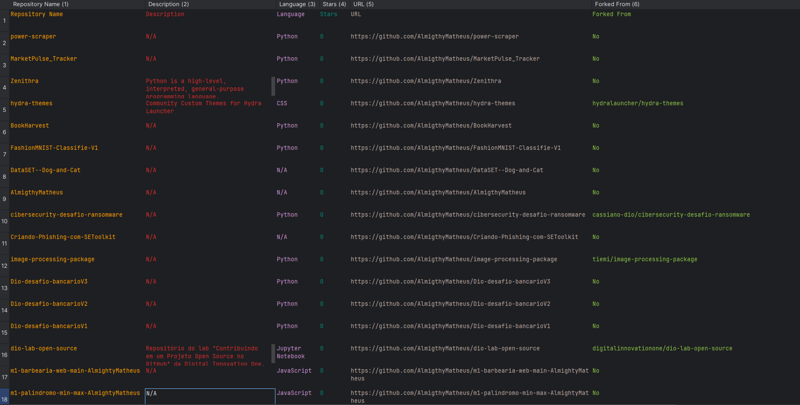

# GitMiner – GitHub Profile Repository Scraper with Streamlit

GitMiner is a user-friendly tool that scrapes all public repositories from any GitHub username or organization, and exports the results to CSV or Excel (XLSX) format. Now with a visual interface using Streamlit!

---

## 🚀 Features

- Insert a GitHub username/organization and view all their public repositories
- Extracts:
  - Repository name
  - Description
  - Language
  - Stars
  - License
  - Forked status
  - URL
- Export results to `.csv` and `.xlsx` with a single click
- Built-in delays to respect GitHub's rate limits

---

## 🛠️ Requirements

Install everything needed using:

```bash
pip install -r requirements.txt
```

Or manually:

```bash
pip install streamlit beautifulsoup4 requests lxml pandas openpyxl
```

---

## 💻 How to Run Locally

Use this command in your terminal:

```bash
streamlit run app.py
```

Then open the browser at the URL shown (usually `http://localhost:8501`)

---

## 📦 File Structure

```text
📁 GitMiner/
├── app.py                # Streamlit app
├── requirements.txt      # Dependencies
├── README.md             # You're reading it
├── example.csv           # Example output
```

## 🖼 Example Output

Below is an example of the CSV result visualized:



---

## ⚙️ Streamlit Configuration (Optional)

If you want to customize the layout, port or theme, add a file named `.streamlit/config.toml` with the following:

```toml
[server]
headless = true
port = 8501
enableCORS = false

[theme]
base = "light"
primaryColor = "#5c33f6"
```

> You can skip this unless you're deploying or customizing.

---

## 🧠 About

Created by [AlmightyMatheus](https://github.com/AlmigthyMatheus) to automate GitHub profile scraping with a clean visual interface.
```